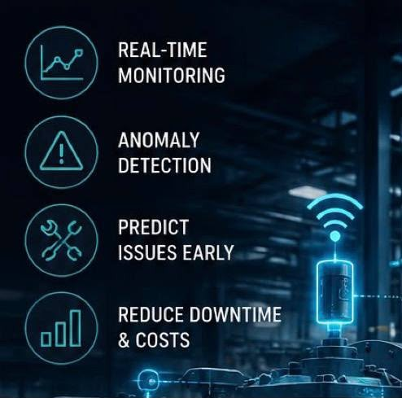

# Autonomous Heavy Industrial Predictive Maintenance System (PMS) ⚙️⚡
> **Autonomous Heavy Industrial IoT Telemetry, Physics Simulation & AI Predictive Diagnostics Web Platform**



## 📌 Overview
The **Predictive Maintenance System (PMS)** is an autonomous, high-reliability industrial web platform designed for mission-critical monitoring of heavy rotating machinery, drivetrains, and electric motor bearings.

Built upon a **Hardware-in-the-Loop (HIL) Ready Architecture**, the system currently runs a **Realistic Physics-Based Simulation Engine** calculating thermodynamics, mechanical harmonics, degradation, and cross-sensor anomalies in real time, while providing plug-and-play adaptability for direct connection with real IoT sensors (ESP32/RPi) and remote databases (Supabase/PostgreSQL) with zero UI code changes.

---

## 🔬 Core Scientific & Technical Architecture

### 1. Realistic Physics-Based Simulation Engine (`js/physics-engine.js`)
- **Lumped-Parameter Thermal Dynamics**: Continuous differential heat accumulation and cooling:
  $$\frac{dT}{dt} = \frac{P_{\text{loss}} - k_{\text{cool}}(T - T_{\text{amb}})}{C_{\text{thermal}}}$$
- **Multi-Axis Vibration Dynamics (RMS)**: Continuous mechanical vibration calculation with bearing inner/outer race harmonic defects and axial thrust resonance:
  $$V_{\text{RMS}} = \sqrt{\frac{V_x^2 + V_y^2 + V_z^2}{3}}$$
- **Electromagnetic Current & Torque Dynamics**: Real-time electrical power absorption and phase current calculations under load and speed variances.
- **Statistical Gaussian Noise (Box-Muller Transform)**: Naturalistic stochastic fluctuations simulating genuine industrial MEMS accelerometer and thermocouple readings.

### 2. Scientific Diagnostics & Prognostics Suite (`js/diagnostics-engine.js`)
- **Machine Health Index (0 - 100%)**: Multivariate weighted composite degradation index.
- **Remaining Useful Life (RUL) Estimation**: Exponential fatigue degradation model calculating remaining operating hours and days before critical mechanical seizure:
  $$\text{RUL} = \text{Base\_Life} \times e^{-\alpha \times \text{Degradation}}$$
- **Cross-Sensor Anomaly Confidence Score**: Cross-metric statistical validation ensuring sensor coherence (e.g. verifying that thermal spikes correlate with friction and vibrational excitation).
- **ISO 10816-3 Vibration Severity Classification**: Automatic classification across Class II industrial machinery standards (Zone A, B, C, D).

### 3. Hardware-in-the-Loop (HIL) Plug-and-Play Data Layer (`js/data-layer.js`)
- Dynamic ingestion layer enabling instant switching between:
  - `SIMULATOR`: Continuous real-time physics simulation.
  - `DATABASE`: Supabase / PostgreSQL REST ingestion.
  - `HARDWARE`: Direct edge MQTT/HTTP telemetry streams from physical microcontroller nodes.
- Switchable via top navigation dropdown, localStorage, or URL parameters (`?source=HARDWARE`).

### 4. Interactive Fault Injection Panel
Operators and evaluators can trigger realistic fault conditions directly from the interface:
- **Thermal Overheat**: Cooling system failure ($T > 90^\circ\text{C}$).
- **Vibration Anomaly**: Bearing outer race failure and severe axial thrust vibration ($V_z > 8.0\text{ mm/s}$).
- **RPM Overspeed & Overload**: Motor runaway ($> 4400\text{ RPM}$) with electrical current surge ($> 30\text{ A}$).

### 5. Full Bidirectional Telegram Bot Integration (`js/telegram-bot.js`)
Integrated Telegram bot operating in the background:
- **Bot Token**: `8664722270:AAE7OJYP7Jwn1rV_B0Ty0oHm6RRi-PQZYy4`
- **Default Chat / User ID**: `8984846317`
- **Instant Hazard Alerts**: Formatted HTML emergency dispatch triggered when safety thresholds are breached or fault scenarios are injected.
- **Interactive Commands (with Inline Keyboards)**:
  - `/start`: Welcome screen and system control hub.
  - `/status`: Instant snapshot of live sensor telemetry and health index.
  - `/report`: Comprehensive technical diagnosis and RUL prognosis.

### 6. Technical Diagnostics Report Export
- One-click print/PDF generation of comprehensive technical diagnostic reports, including executive assessments, ISO ratings, KPI breakdowns, and historical telemetry tables.

---

## 🛠️ Operating Thresholds Reference Table

| Telemetry Channel | Nominal Safe Band | Warning Zone | Critical Hazard (Danger) |
| :--- | :--- | :--- | :--- |
| **Current (A)** | 5.0 – 20.0 A | 20.1 – 28.0 A | > 28.0 A |
| **Vibration (X/Y/Z)** | < 3.5 mm/s | 3.5 – 6.5 mm/s | > 6.5 mm/s |
| **Shaft Speed (RPM)** | 1,200 – 3,200 RPM | 3,200 – 4,200 RPM | > 4,200 RPM or < 600 RPM |
| **Temperature (°C)** | 25.0 – 65.0 °C | 65.1 – 85.0 °C | > 85.0 °C |

---

## 📦 How to Run
Simply open `index.html` directly in any web browser, or serve locally using any static web server:
```bash
# Double-click index.html or open via browser
```
All physics simulations, telemetry streams, diagnostics, and Telegram bot communications execute seamlessly client-side.
